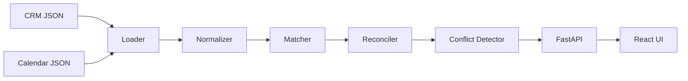

# Event Sync Service

Take-home assessment for a Full Stack Engineer role.

This project ingests meeting data from two independent systems (CRM and Calendar), reconciles records that refer to the same real-world meeting, detects data conflicts between sources, and exposes the unified results through a REST API and a React frontend.

---

# 🚀 Quick Start

After cloning the repository:

```bash
python start.py
```

The launcher automatically:

- verifies that the backend virtual environment exists
- verifies that frontend dependencies are installed
- starts the FastAPI backend
- starts the React development server
- opens the application in your default browser

If any required dependency is missing, the launcher will provide instructions on how to install it.

---

## Features

- Ingests data from **CRM** and **Calendar** JSON sources.
- Normalizes both sources into a common internal model.
- Reconciles meetings using a weighted matching algorithm.
- Detects conflicting values between sources.
- Exposes a REST API using **FastAPI**.
- Provides a simple React UI for browsing reconciled meetings.
- Allows expanding a meeting row to compare CRM and Calendar data side-by-side.

---

## Tech Stack

### Backend

- Python 3.12
- FastAPI
- Uvicorn
- Dataclasses

### Frontend

- React
- TypeScript
- Vite

---

## Assumptions

Since the original specification intentionally leaves several behaviors undefined, the following assumptions were made:

- meetings with a score of **70 or higher** are considered matches
- comparisons between text fields are case-insensitive
- missing values are preserved rather than inferred
- each Calendar meeting can only match one CRM meeting
- the highest scoring unused Calendar record is selected during reconciliation

---

## Architecture

The application is organized as a simple reconciliation pipeline.



### Responsibilities

| Component | Responsibility |
|-----------|----------------|
| Loader | Reads raw JSON files |
| Normalizer | Converts source-specific records into a common Meeting model |
| Matcher | Computes similarity scores |
| Reconciler | Produces unified meetings |
| Conflict Detector | Detects conflicting values |
| API | Exposes reconciled meetings |
| Frontend | Displays reconciled meetings and source comparison |

---

## Project Structure

```text
event-sync-service/
├── backend/
│   ├── app/
│   │   ├── api/
│   │   ├── models/
│   │   ├── services/
│   │   ├── utils/
│   │   └── main.py
│   ├── data/
│   ├── requirements.txt
│   └── .venv/
│
├── frontend/
│   ├── src/
│   │   ├── api/
│   │   ├── components/
│   │   ├── hooks/
│   │   ├── types/
│   │   ├── utils/
│   │   └── App.tsx
│   └── package.json
│
├── docs/
│   └── AI_NOTES.md
│
├── start.py
└── README.md
```

---

## Running the Project

### Recommended

Simply run:

```bash
python start.py
```

This starts both the backend and frontend with a single command.

---

### Manual Setup

If you prefer to run each service independently:

### Backend

```bash
cd backend

python -m venv .venv

# Windows
.venv\Scripts\activate

# Linux / macOS
source .venv/bin/activate

pip install -r requirements.txt

uvicorn app.main:app --reload
```

Backend:

- http://localhost:8000

Swagger:

- http://localhost:8000/docs

---

### Frontend

```bash
cd frontend

npm install

npm run dev
```

Frontend:

- http://localhost:5173

---

## API Endpoints

### GET /health

Returns service health.

Example:

```json
{
    "status": "ok"
}
```

---

### GET /meetings

Returns the reconciled meeting list.

Example:

```json
[
  {
    "match_score": 95,
    "crm": { },
    "calendar": { },
    "conflicts": {
      "location": {
        "crm": "HQ - Conference Room B",
        "calendar": "Conference Room B"
      }
    }
  }
]
```

---

## Matching Strategy

The two upstream systems do not share a common identifier.

Instead of exact matching, meetings are reconciled using a weighted scoring algorithm.

### Scoring Rules

| Rule | Score |
|------|------:|
| Same calendar day | 30 |
| Start time within ±30 minutes | 25 |
| Same owner / organizer | 15 |
| Company appears in meeting title | 30 |

Maximum score:

**100**

A match is accepted when the score is **70 or higher**.

### Why a Score Instead of Exact Matching?

Exact matching would fail because the provided datasets contain:

- different titles
- slightly different timestamps
- names vs email addresses
- missing values
- duplicated records

A weighted score produces explainable results while remaining easy to extend.

---

## Conflict Detection

After two meetings have been reconciled, overlapping fields are compared.

Currently checked fields:

- location
- status
- start time

Example:

CRM

```text
HQ - Conference Room B
```

Calendar

```text
Conference Room B
```

Produces

```json
{
  "location": {
    "crm": "HQ - Conference Room B",
    "calendar": "Conference Room B"
  }
}
```

### String Normalization

Before comparing text fields, values are:

- trimmed
- converted to lowercase

This prevents false positives such as:

```text
Confirmed
confirmed
```

---

## Frontend

The frontend presents the reconciled meetings as an expandable table.

Each row can be expanded to inspect:

- CRM values
- Calendar values
- detected conflicts

Displaying details inline allows users to inspect a meeting without losing their place in the table.

---

## Design Decisions

### Preserve Source Records

Rather than merging everything into a single object, each `UnifiedMeeting` keeps both the CRM record and the Calendar record.

Benefits:

- preserves data provenance
- simplifies conflict visualization
- makes reconciliation transparent

---

### Greedy Matching

Each CRM meeting is matched with the highest-scoring unused Calendar meeting.

Benefits:

- one-to-one matching
- deterministic results
- avoids duplicate associations

---

### Preserve Missing Values

The application intentionally does **not infer missing information**.

For example, if the CRM does not provide `client_company`, the UI displays **"Not available"** rather than deriving the value from another source.

This keeps the displayed information faithful to its original source.

---

### Expandable Rows

Instead of displaying meeting details in a separate page or modal, the frontend expands the selected row.

This keeps the user in context while comparing values from both systems.

---

## Future Improvements

Given additional time, the project could be extended with:

- RapidFuzz for fuzzy company matching
- PostgreSQL persistence
- background synchronization jobs
- pagination
- filtering and searching
- confidence levels (High / Medium / Low)
- richer conflict models
- unit tests for matching and reconciliation
- integration tests for the REST API

---

## AI Collaboration

AI tools were used as a collaborative assistant for:

- discussing reconciliation strategies
- reviewing implementation ideas

All implementation decisions, code integration, and final design choices were manually reviewed and adapted.

Additional details are available in:

```
docs/AI_NOTES.md
```

---

## Time Spent

Approximately **8–10 hours**, including:

- architecture and project design
- backend implementation
- normalization
- reconciliation algorithm
- conflict detection
- REST API
- React frontend
- documentation
- testing and polishing
